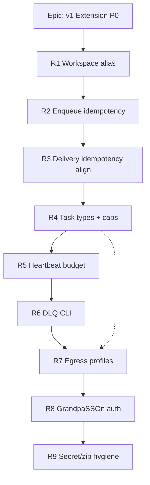

# TaskConnect v1 Extension — Implementation Plan

**Origin:** `docs/superpowers/specs/2026-07-22-taskconnect-v1-extension-spec.md`  
**Base authority:** `docs/http-task-scheduler-spec.md` (wins on v0 conflicts)  
**Companion:** GrandpaSSOn v1 extension (`tasks:callback`, `tasks:write`)  
**Date:** 2026-07-22

## Problem frame

v0 schedules tenant/environment HTTP tasks with MySQL claim leases + cron. The knowledge-platform needs workspace-scoped jobs, end-to-end idempotency, resource governance, DLQ, named egress, and GrandpaSSOn-delegated auth — **without** breaking shared-hosting constraints (no Redis/daemon).

## Scope boundary

| In (this plan) | Out until §11 review |
|----------------|----------------------|
| P0 R1–R9 in order | P1 R10–R15 (pipelines, coalesce, fairness, DLQ alerts, UI, submit rate limits) |
| Docs + issues + migrations that keep v0 green | P2 R16–R18 |
| Environment ↔ Workspace mapping decision | In-process convert/crawl/embed (N1) |

**Stop line (§11):** When R1–R9 have tests green and `tc release` clean, **stop and request review** before P1.

## Architecture decisions

1. **Workspace = Environment (v1 alias).** Map `workspace_id` API field to existing `environment_id` / `Environment` public id. Avoid a second hierarchy until Workspace gains distinct semantics (quotas beyond env). Document alias in API resources; keep DB column `environment_id` unless a later rename migration is justified.
2. **Task type = config + optional DB table.** Seed named types (`document.convert`, `site.crawl`, `kb.index`, `publish.build`, `note.reminder`) with priority/weight/timeout/caps/egress from `config/task_types.php` + env overrides (Q4 defaults). Persist `task_type` on tasks.
3. **DLQ = `run_state=dead` + CLI.** No separate DLQ table for P0; artisan commands list/show/replay dead runs. Replay = new attempt group / new delivery idempotency key (per §6.6).
4. **Egress profiles wrap `OutboundPolicy`.** Profiles `internal` | `public-crawl` | `api` select allowlists / deny rules; keep DNS-pinned transport. Ship `public-crawl` unused by default (Q3).
5. **GrandpaSSOn is required for R8** (Q1 default: no local-only auth path). Gate R8 behind config + cross-repo `tasks:write` ticket; keep Sanctum/API-key for SPA/v0 until cutover flags allow dual mode during migration.
6. **Delivery idempotency header:** Prefer Extension Spec `Idempotency-Key` while retaining `X-Task-Idempotency-Key` for one release if needed for compatibility.

## Sequencing (P0 only)

Implement **in order R1→R9**. Do not start R(n+1) until R(n) acceptance tests pass (spec §0). R7 can share design work with R4 (`egress_profile` on type) but claimer caps (R4) should land before profile selection is enforced on delivery.

## Gap summary (current main)

| Req | Status | Notes |
|-----|--------|-------|
| R1 | **Done** (#17) | Environment ↔ workspace_id API alias; audit_logs.environment_id; see `docs/architecture/workspace.md` |
| R2 | Partial | Idempotency middleware optional on create/run-now |
| R3 | Exists | Stable run key via `X-Task-Idempotency-Key` |
| R4 | Missing | No task types / priority / weight / caps |
| R5 | Partial | `target_duration_seconds` unused |
| R6 | Partial | `dead` state + API retry; no DLQ artisan |
| R7 | Partial | Global SSRF + tenant allowlist; no named profiles |
| R8 | Missing | No GrandpaSSOn / HMAC callback signing |
| R9 | Partial | Secrets encrypted; release zip scan thin |

## Open questions (defaults applied)

| # | Default we will implement |
|---|---------------------------|
| Q1 | Cross-repo GrandpaSSOn `tasks:write`; dual-mode inbound until ready |
| Q2 | Delayed `run_at` formalized if missing; recurring stays structured kinds |
| Q3 | Ship `public-crawl` profile unused |
| Q4 | Global 4; convert 2; crawl 1; index 2; reminder 4 |
| Q5 | Introspect inbound; cache outbound client-credentials |
| Q6 | DLQ 30d; enqueue idempotency 24h |

## GitHub issues

Canonical tracking (created 2026-07-22):

| Issue | Title |
|-------|-------|
| [#16](https://github.com/suporterfid/taskconnect/issues/16) | Epic: P0 stop line (R1–R9) |
| [#17](https://github.com/suporterfid/taskconnect/issues/17) | P0/R1 Workspace scoping |
| [#18](https://github.com/suporterfid/taskconnect/issues/18) | P0/R2 Enqueue idempotency |
| [#19](https://github.com/suporterfid/taskconnect/issues/19) | P0/R3 Delivery idempotency |
| [#20](https://github.com/suporterfid/taskconnect/issues/20) | P0/R4 Task types + caps |
| [#21](https://github.com/suporterfid/taskconnect/issues/21) | P0/R5 Heartbeat budget |
| [#22](https://github.com/suporterfid/taskconnect/issues/22) | P0/R6 DLQ CLI |
| [#23](https://github.com/suporterfid/taskconnect/issues/23) | P0/R7 Egress profiles |
| [#24](https://github.com/suporterfid/taskconnect/issues/24) | P0/R8 GrandpaSSOn auth |
| [#25](https://github.com/suporterfid/taskconnect/issues/25) | P0/R9 Secret / release hygiene |
| [#26](https://github.com/suporterfid/taskconnect/issues/26) | Cross-repo GrandpaSSOn `tasks:write` |
| [#27](https://github.com/suporterfid/taskconnect/issues/27) | Epic: P1 (after P0 review) |
| [#28](https://github.com/suporterfid/taskconnect/issues/28)–[#33](https://github.com/suporterfid/taskconnect/issues/33) | P1 R10–R15 |
| [#34](https://github.com/suporterfid/taskconnect/issues/34) | Epic: P2 R16–R18 |
| [#35](https://github.com/suporterfid/taskconnect/issues/35) | Open questions Q1–Q6 defaults |

Spec copy: `docs/superpowers/specs/2026-07-22-taskconnect-v1-extension-spec.md`.

## Definition of Done (each P0 issue)

- Idempotent migration if schema changes; no destructive v0 changes
- Unit + feature tests for acceptance criteria; `tc test` green
- No hardcoded secrets; config via `.env` / `.env.example`
- Docs under `docs/` updated when behavior is user-visible
- `tc release` still produces a clean zip (R9 hardens the check)
